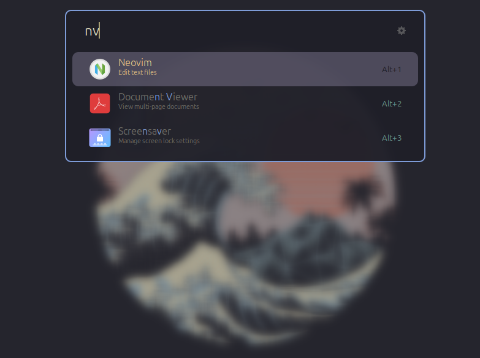

# Ulauncher - Kanagawa Theme

A [Ulauncher](https://github.com/Ulauncher/Ulauncher) theme inspired by the [Neovim Kanagawa Colorscheme](https://github.com/rebelot/kanagawa.nvim) palette.

## Preview



## Installation

```sh
mkdir -p ~/.config/ulauncher/user-themes/kanagawa
git clone https://github.com/heinzmmo/ulauncher-kanagawa ~/.config/ulauncher/user-themes/kanagawa
```

## Acknowledgements

- [Ulauncher](https://github.com/Ulauncher/Ulauncher) – for providing the launcher and theme system.
- [Kanagawa.nvim](https://github.com/rebelot/kanagawa.nvim) – for the beautiful color palette inspiration.
